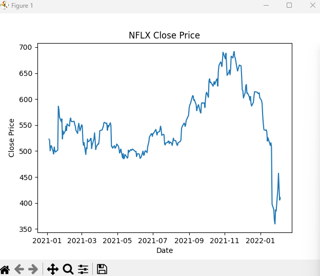

# TIL


##  F01 CSV 파일 읽어오기

```python
  import pandas as pd
  url = ' '
  df = pd.read_csv(url)
  df = df.loc[:, ['Date', 'Open', 'High', 'Low', 'Close']]
  # loc로 할당할때, 자동으로 DataFrame이 된다.
  print(df)
```


## F02 날짜 필터링 (2021년 이후로)

```python

  df1 = df[df['Date'] < '2021-01-01'].index   # 조건에 해당하는 값들의 인덱스를 갖와 df1에 추가한다
  df.drop(df1, inplace=True) # df 데이터프레임에서 df1와 같은 인덱스 목록 일치하는 행을 삭제
  df['Date'] = pd.to_datetime(df['Date']) # 컴퓨터가 날짜로 인식하는 datetime 형식으로 형변환

  x = df['Date']
  y = df['close']
  
  # 그래프 그리기
  plt.plot(x, y)

  # x축 y축 라벨링 하기
  plt.xlabel('Date')
  plt.ylabel('Close Price')

  #그래프 맨위에 타이틀 붙이기
  plt.title('NFLX Close Price')

  # 그래프 출력
  plt.show()

```



## F03 종가의 맥스값, 미니멈값 추출하기

```python
df_max = df['Close'].max()   # df1 데이터프레임에서 Close열의 최대값을 할당한다
df_min = df['Close'].min()   # df1 데이터프레임에서 Close열의 최소값을 할당한다.
print(df_max)
print(df_min)


```


## F04 평균 종가 만들기

```python

# df1 = df[df['Date'] < '2021-01-01'].index   # 조건에 해당하는 값들의 인덱스를 갖와 df1에 추가한다
# df.drop(df1, inplace=True) # df 데이터프레임에서 df1와 같은 인덱스 목록 일치하는 행을 삭제
# df['Date'] = pd.to_datetime(df['Date']) # 컴퓨터가 날짜로 인식하는 datetime 형식으로 형변환

# 일간 데이터를 -> 월간 데이터로 추출하여 새로운 열을 만든다
df['Month'] = df['Date'].dt.strftime('%Y-%m')

#종가 평균을 월간데이터로
mon_close_price = df.groupby('Month').mean()['Close']

x = mon_close_price.index
y = mon_close_price.iloc[:]


# 그래프 그리기
plt.plot(x,y)
plt.xlabel('Date')
plt.ylabel('Average Close Price')
plt.xticks(x[::2])
plt.title('Monthly Average Close Price')

# 그래프 출력
plt.show()

```


## F05 2022년 이후 월별 데이터 시각화

```python 
df3 = pd.DataFrame(df)
df4 = df3[df['Date'] < '2022-01-01'].index
df3.drop(df4, inplace=True)

#F05 Date 열에 있는 문자열을 datetime 형식으로 변환한다
df3['Date'] = pd.to_datetime(df3['Date'])

#F05 2022년 이후매달 그룹화 ->평균
monthly_average_month = df3


#F05 x축에 날짜를 표시하기 위해 'Date' 열을 인덱스로 설정합니다.
df3.set_index('Date', inplace=True)

#F05 그래프 시각화
plt.plot(df3.index, monthly_average_month['Low'], label='Low')
plt.plot(df3.index, monthly_average_month['High'], label='High')
plt.plot(df3.index, monthly_average_month['Close'], label='Close')
plt.xlabel('Date') # x축 라벨 추가
plt.ylabel('Price') # y축 라벨 추가

#F05 x축 글자를 45도 회전시켜 겹치지 않게 합니다.
plt.xticks(rotation=45)
#F05 라벨이 그래프 영역을 벗어나지 않도록 레이아웃을 자동 조정합니다.
plt.tight_layout()

plt.legend()
plt.show()
```


## 새로 배운 것

- 주피터 노트북의 사용법에 대해 배웠다.
- pandas와 Matplotlib를 활용해, 데이터를 추출, 가공하고 시각화 하는 방법을 배웠다.
- 